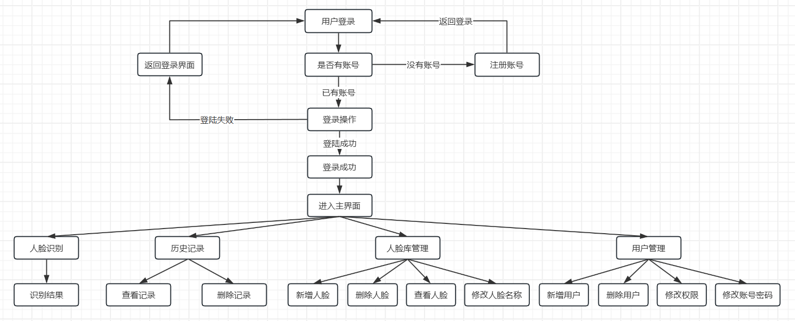
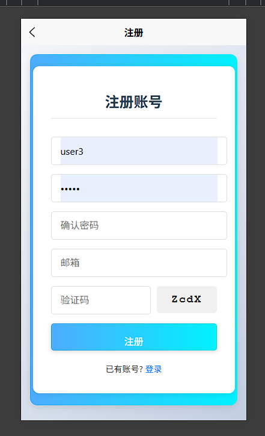
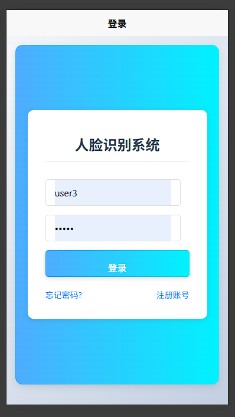
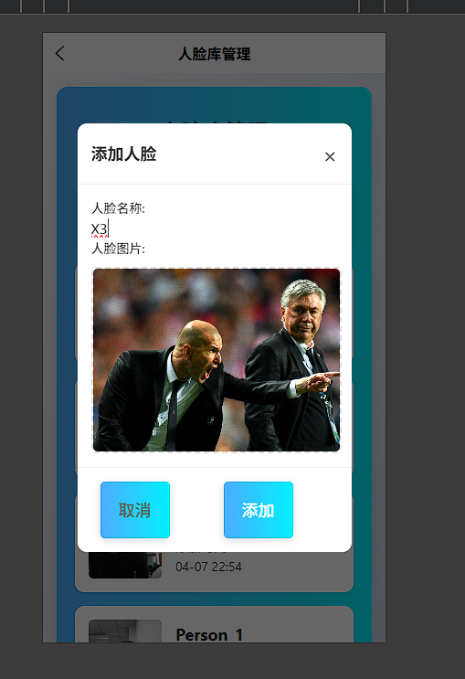
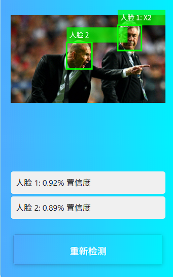
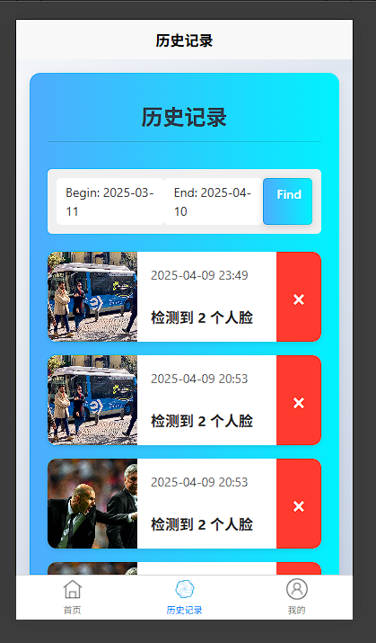
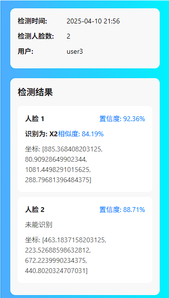
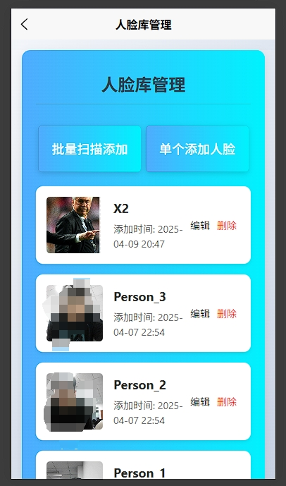
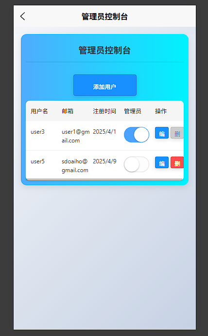

# YOLOV5目标检测项目

这是一个基于YOLOV5的人脸检测识别uniapp项目，主要功能包括：

- 针对图像人脸目标检测与识别比对
- 高精度检测结果
- 易于部署和使用

主要使用 python django 和 uniapp 开发

## 快速开始

```bash
git clone https://github.com/edxuanlen/face_recognition_uniapp
cd server
conda create -n face_recognition python=3.12
conda activate face_recognition
pip install -r requirements.txt

# dlib 安装需要依赖camke 和 Visual Studio C++ 库
# 或者 conda install --channel conda-forge dlib
python manage.py makemigrations
python manage.py migrate
python manage.py runserver 0.0.0.0:8080
```


## 项目流程



## 效果图


















## 需要二次开发或其他合作可以联系

mail: edxuanlen@gmail.com;edxuanlen@163.com
wechat: edxuanlen
